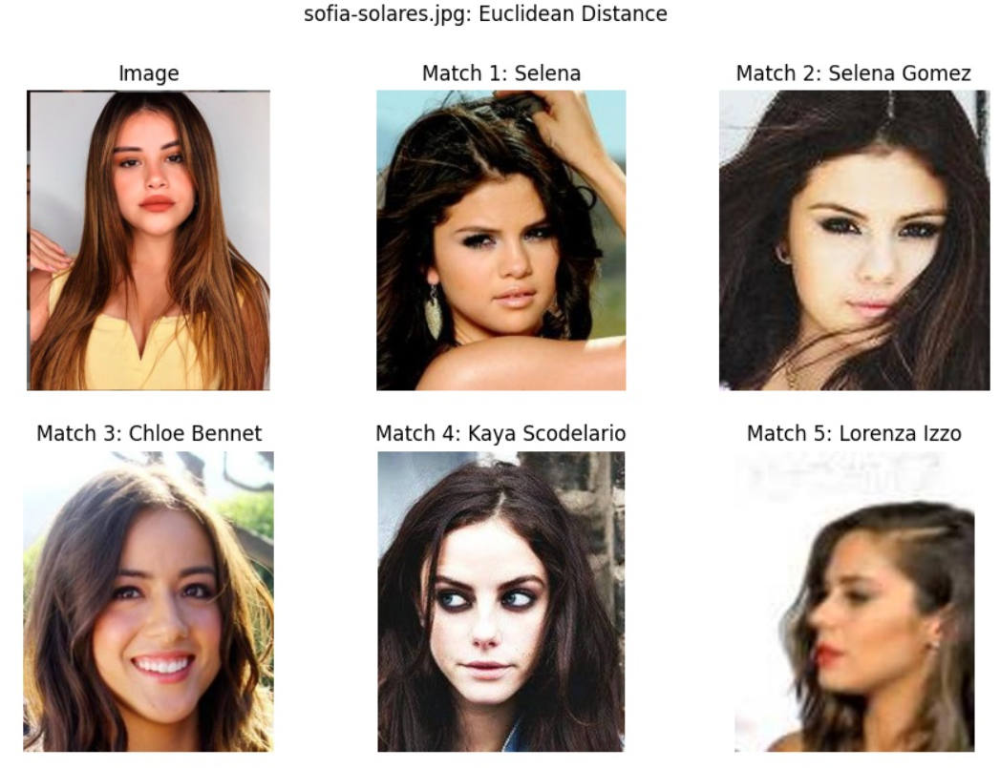
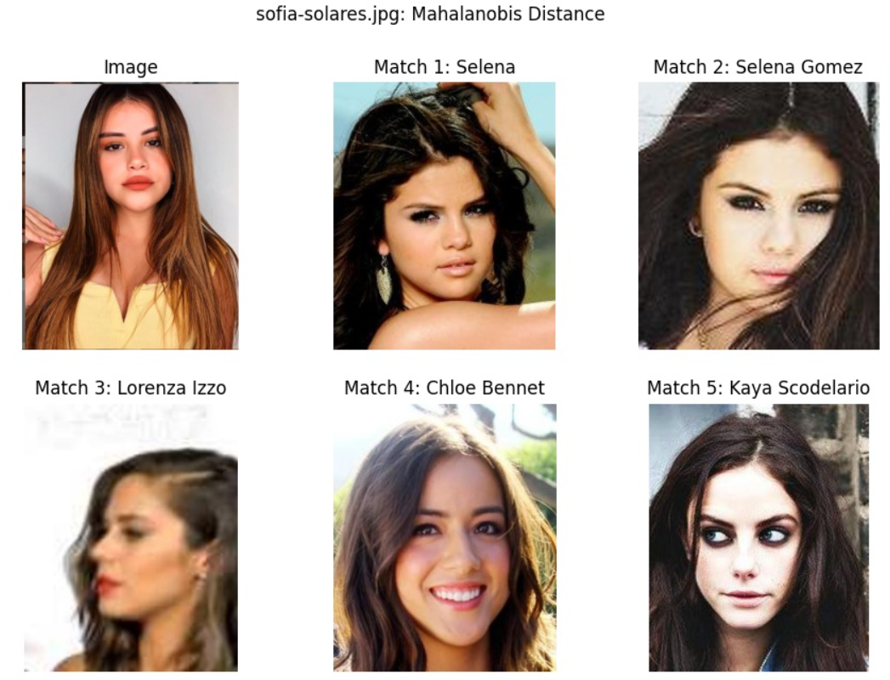

<!DOCTYPE html>
<html>
<head>
  <link rel="stylesheet" type="text/css" href="styles.css">
</head>
<body>
  
## Objective
    
Given a dataset of celebrity images, labeled by name, create a low-dimensional descriptor representing the likeness of the face detected in each image. Using this low-dimensional descriptor, compute a similarity score between faces detected in test images and the celebrities in the dataset. The celebrity with the highest similarity score is declared the *“lookalike”* or *“doppelganger”* to an individual detected in a test image.
The research is about using Convolutional Neural Networks (CNN) to classify several types of touch interaction (poke, scratch, gentle stroke, hard press, and neutral) from humans by learning the data pattern from a force sensor. This sensor converts human touch into 3-dimensional force data.
    
## The Dataset
    
The course moderators provided a dataset, dubbed **“celeb_mini”**, that contains ~5 images per celebrity for 1000+ celebrities. There is significant variation in the dataset across the following factors:

* IIlumination  
* Face Pose  
* Foreground clutter - some images have copyright data overlaid  
* Sharpness/clarity of the image - some images are quite blurry

## Solution

Because I am provided with a dataset for this activity, my solution has two phases: training and testing. During the training phase, I will find representative and informative descriptors for each image in the training set *(i.e. the celeb_mini dataset)*. During the testing phase, I will apply the learned descriptor model (a function of the input image) to a test image and then find the most similar images in the training set with respect to the learned descriptor.

The solution is constructed in C++, and the primary APIs used in my solution are:

* `OpenCV` - used for basic image loading/saving and image processing  
* `dlib` - used for linear algebra operations (length, linear systems solvers, and matrix processing), face detection, and for deep neural network inference  
* `matplotlibcpp` - for plotting data

Before discussing each phase in greater detail, I will present my chosen descriptor model and justification.

## Descriptor

Considering the givens and assumptions for this project, I’d like a descriptor with the following qualities:

* Low dimensionality (makes comparison simpler and reduces redundancy across dataset)
* Descriptors for images with the same label (i.e. represent the same celebrity) are highly similar (close in some metric sense)
* Descriptors for images with different labels are highly dissimilar (far apart in some metric sense)

In the course materials, a solution based on this representative example is presented that addresses all three points above using a deep learning-based approach. The solution uses a backbone architecture based on a `ResNet` pre-trained using metric loss to create a *128-dimensional descriptor* of each input image. To avoid unnecessary effort in retraining the backbone network, I first wanted to see the performance on the assigned task (i.e. finding the correct lookalike for each of the two test images discussed in the Introduction section of this page) using the pre-trained network.

For the purpose of this project, this approach was found to be sufficient. In the Discussion section below, I will address deficiencies of using the pre-trained approach when considering use-cases outside of the defined boundaries for the project.
    
## Training

This phase is not “training” in the typical sense, since a pre-trained network is used; rather it is more about generating descriptors for the images in the dataset using the pre-trained network. With this in mind, the training process is outlined as follows:

* Load trainig images  
* Assign unique integral label to each subfolder in the dataset - images in each subfolder represent the same celebrity  
* Map each folder to celebrity name - this will be used to assign celebrity name at the end of the testing process  
* Load pre-trained model weights and biases for computing the descriptors  
* for each image in the training image set
    * detect faces in image
    * for each face in detected faces
    * detect facial landmarks
    * use landmarks to crop facial region from image
    * compute descriptor using cropped facial region
* write celebrity name-to-label map to `csv file` - this will be used to match test image faces to celebrity likeness during the testing phase
* write descriptors, along with labels, to csv file for use during testing phase

The codebase for this step was built using materials provided by the course moderators, so I am not willing to share it here.
    
 
## Testing

This phase’s primary concern is finding the celebrity that most closely resembles individuals detected in a test image. The process is outlined as follows:

* Load pre-trained model weights and biases (the same as in Training phase)
* Load csv file with celebrity name-to-label mapping
* Load csv file with descriptors and associated labels
* Load test image
* Detect faces in test image
* for each face in detected faces
    * detect facial landmarks
    * use landmarks to crop facial region from image
    * compute descriptor using cropped facial region
    * find most similar celebrity using loaded descriptors

The steps in the loop defined above should look familiar: they are the same as those used in the Training phase, with the addition of the matching step. The majority of original work that I did for this project was concerned with the calculation of a similarity metric, so I will focus the discussion around these points.

There are two metrics I used for computing similarity. The first is a simple, nearest-neighbor approach based on the Euclidean distance between descriptor vectors. The second uses Mahalanobis distance, which is a distance measure that is normalized by the covariance over samples from the training set with common label. I will now discuss these two approaches separately.

## Euclidean Distance

Euclidean distance is really easy to interpret: if I look at the descriptor vectors as embeddings in a *128D vector space*, then similar vectors are ones whose tails are close to one another in the normal linear sense. In the context of the problem at-hand, the most similar celebrity to a person detected in a test image will have descriptor with shortest length to the descriptor representing the person detected in the test image.

    

## Mahalanobis Distance

Because we have a few representative samples for each label, the Mahalanobis distance metric provides a way evaluating a statistically-relevant measure of closeness conditioned on the available data. The process for computing the Mahalanobis distance for a test image is as follows:

* Compute mean and variance of descriptor vectors over each label - one time, during initialization
* Use mean and variance over label descriptor vectors to find the label with smallest *Mahalanobis distance* to the test image descriptor

Note: the fundamental assumption of this approach is that the training images for each celebrity are sampled from a normal distribution. Whether or not this is a valid assumption across the entirety of the dataset was not evaluated as part of this project. I just wanted to try out this approach and see how it compares to the *Euclidean distance* approach.

    

## Discussion
         
The discussion here will be brief, since the expected outcome of the project has been successfully demonstrated in the plots from the Results section above; the best match identified for each test image provided matches expectation. What I would like to highlight is the fact that the two approaches lead to similar results for the top, i.e. best, matches. In fact, based on similarity of results achieved for both methods, and the fact that the Euclidean distance approach was much easier to implement, I would focus further efforts with this particular method towards using the Euclidean distance for means of evaluating similarity.

One thing of note is that Matches 1 and 2 for Image 1 claim to represent two different celebrities, Selena and Selena Gomez, however the images representing Selena are, in fact, pictures of Selena Gomez. Since I didn’t have to train the model, this inconsistency in labeling isn’t a big deal, but if I were to refine the model by retraining on the celeb_mini dataset provided, I would merge the two separate folders into one. Moreover, I’d do a deeper dive into the dataset itself to make sure there were no other inconsistencies present.

<a id="scroll-to-top" href="#top">&#8593;</a>

</body>
</html>
